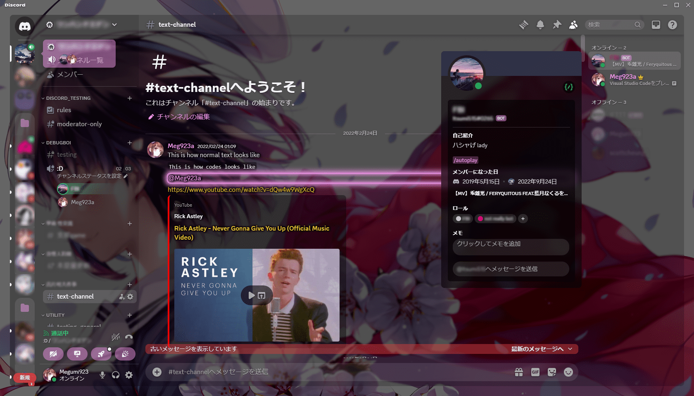

# Meg923a.theme

A Transparent, highly customizable discord theme.

### Installation:
- install [BetterDiscord](https://betterdiscord.app/)
- go to Discord settings -> BetterDiscord -> Themes -> Open Themes Folder
- put [this theme](https://github.com/Meg923a/Meg923a.theme/blob/master/Meg923a_v2.theme.css) inside the folder

### Credits:
This theme is based on [Translucence](https://github.com/CapnKitten/Translucence) by [CapnKitten](https://github.com/CapnKitten).